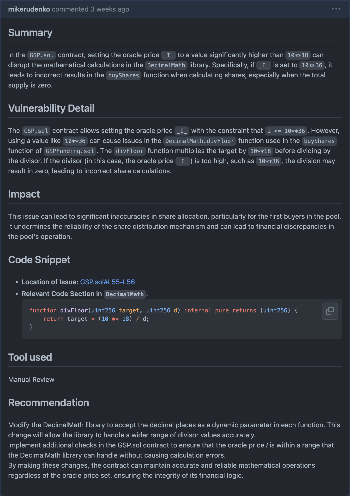
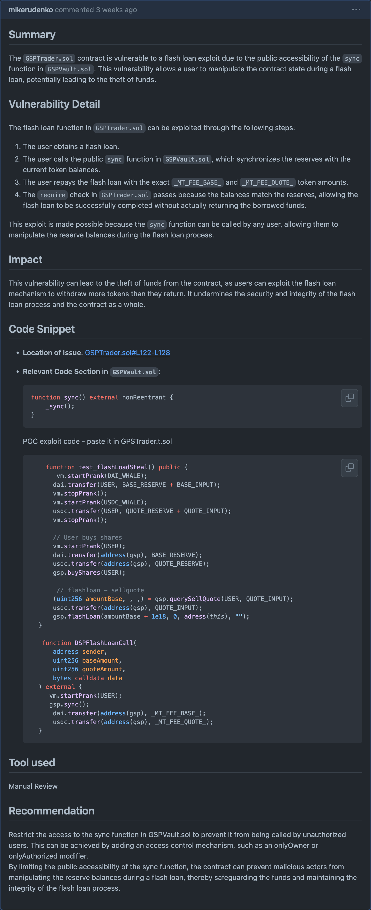
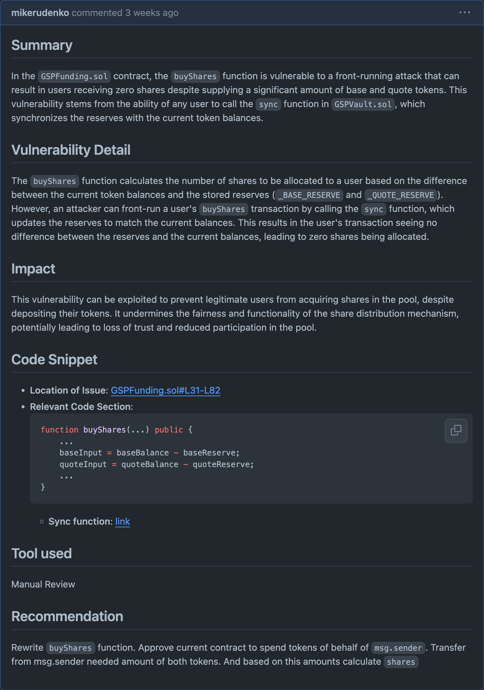
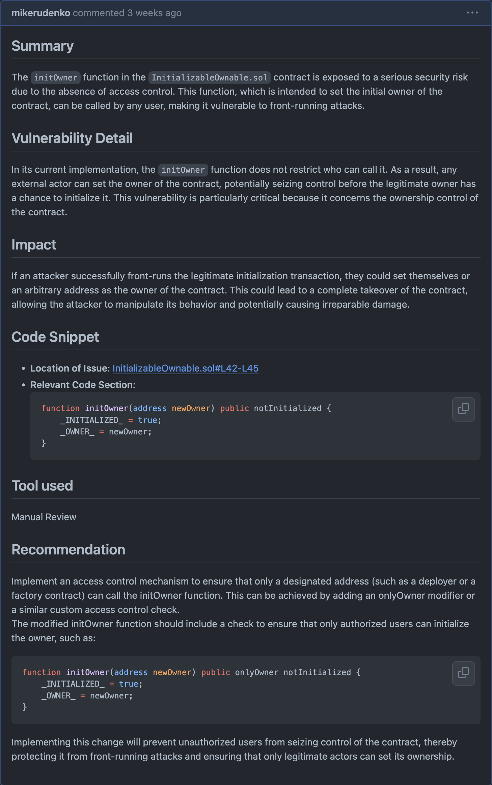
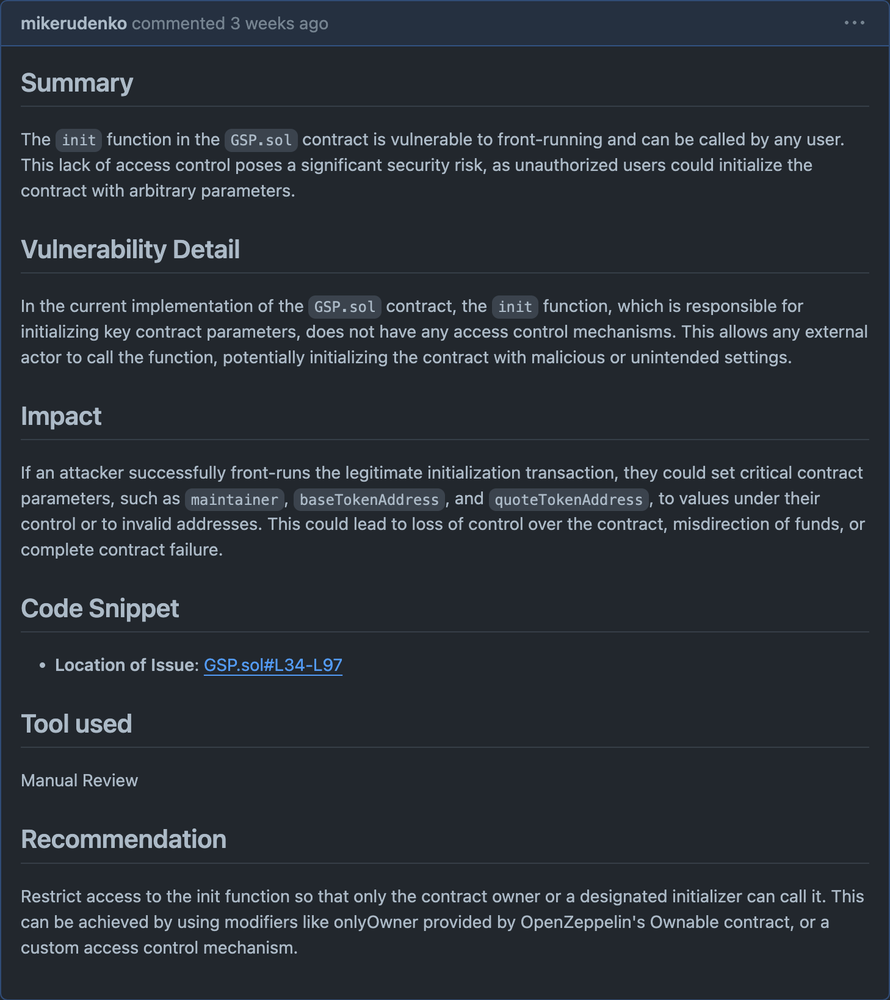
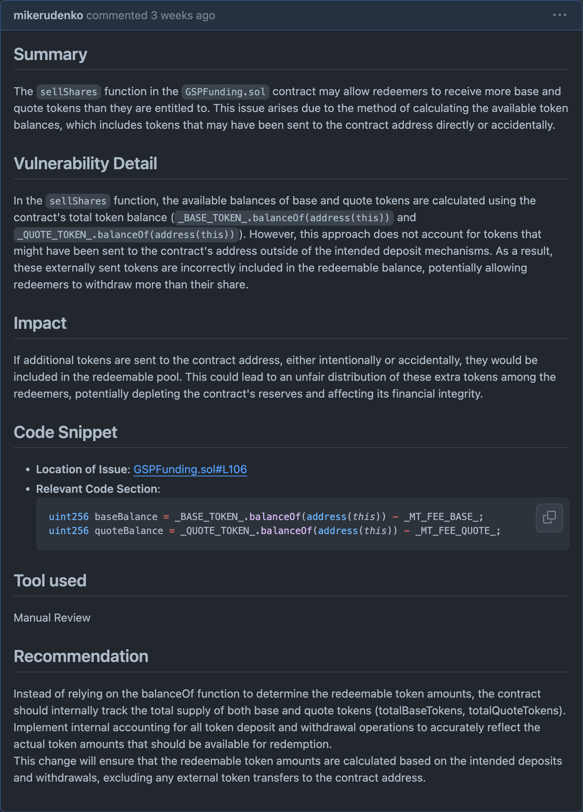
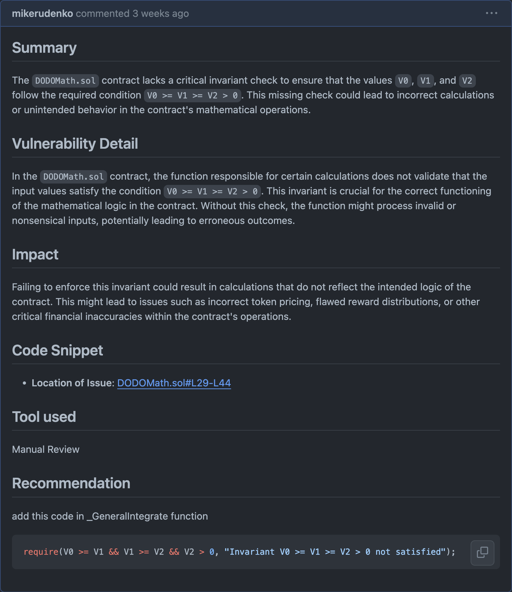
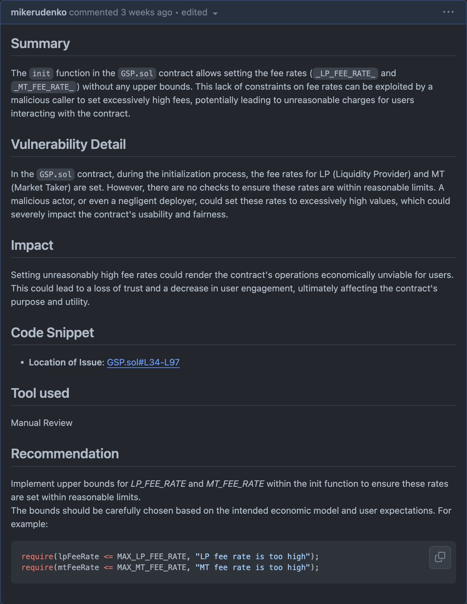

# [H-1] ✅ Breakage in Mathematical Logic Due to Excessive Oracle Price in GSP.sol

# [H-2] ✅ Flash loan borrower can steal funds

# [H-3] ✅ Zero Shares Acquisition Vulnerability in GSPFunding.sol Due to Front-Running 

# [H-4] ✅ Front-Running Vulnerability in InitializableOwnable.sol Due to Lack of Access Control 

# [H-5] ✅ Front-Running Vulnerability in GSP.sol Initialization Function

# [M-1] ✅ Overestimation of Redeemable Tokens in GSPFunding.sol

# [M-2] ✅ Missing Invariant Check in DODOMath.sol

# [M-3] ✅ Unbounded Fee Rates in GSP.sol Initialization Function

