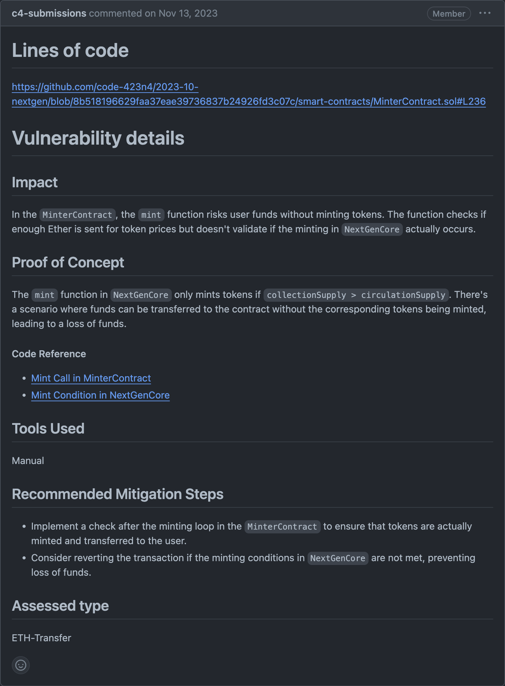
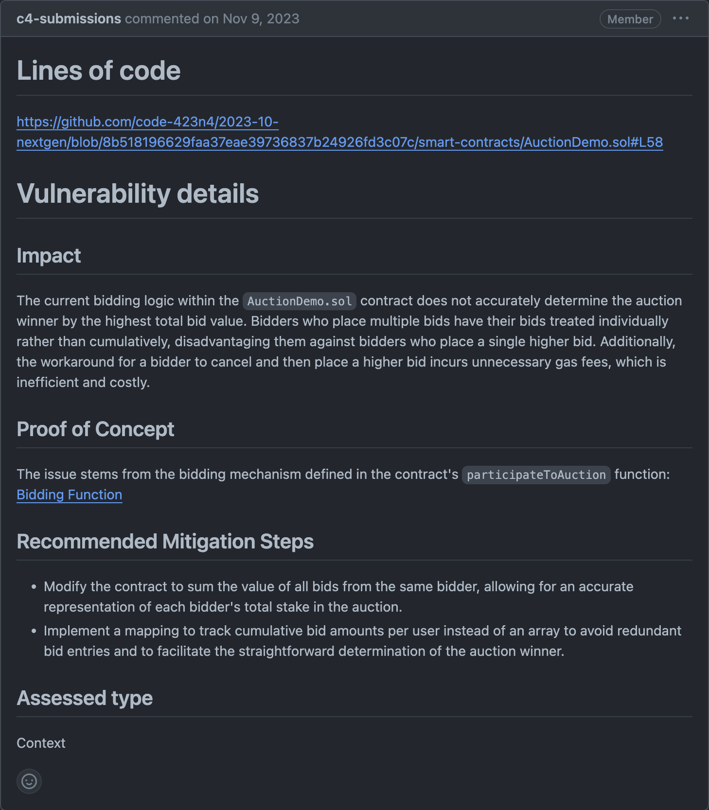
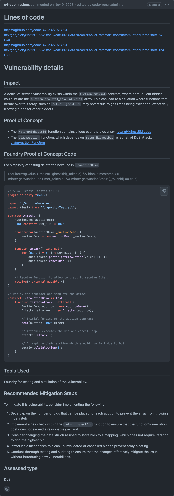
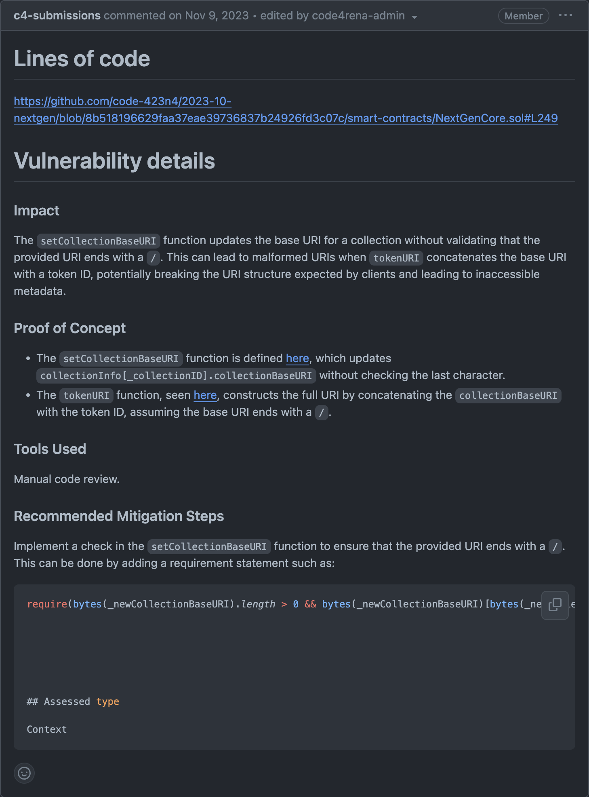
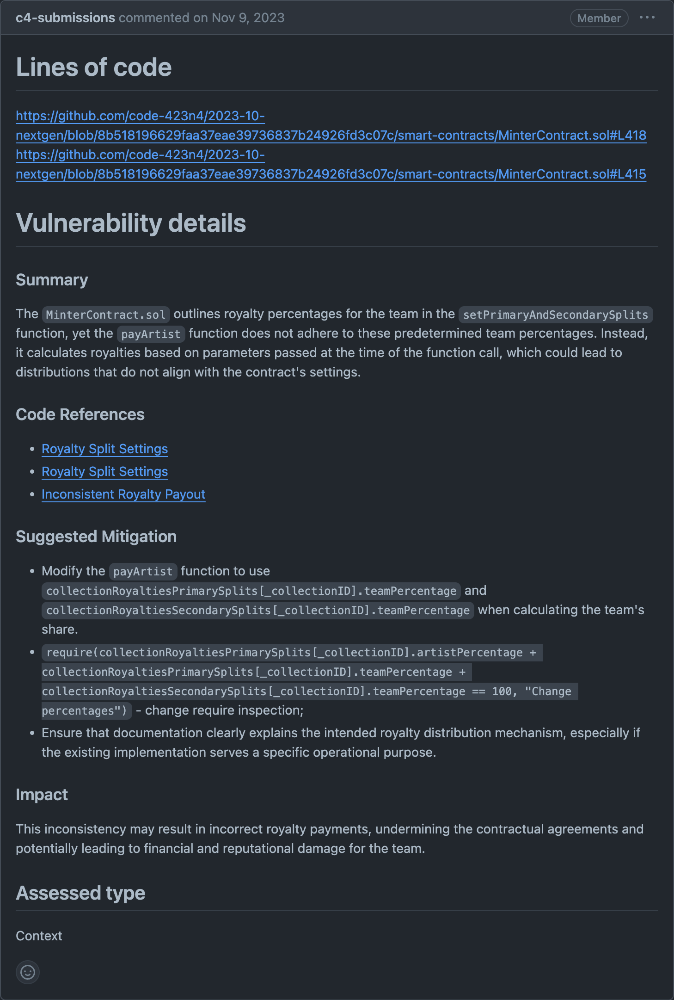

## [H-1] Auction funds can be stollen


## [H-2] Bidders will not receive their funds (DoS), because fraud bidder will apply Gas Grief Attack


## [H-3] Potential Loss of Funds in mint Function of MinterContract


## [H-4] Bidder who provided most ether value in bids to token which is on auction will not win auction 


## [H-5] Fraud bidder can freeze auction money with DoS attack, inflating bids array 



## [M-1] Potential for Accidentally Setting an Empty Collection Script


## [M-2] _mintIndex can be set for collection that does not have it in tokenIdsToCollectionIds mapping


## [M-3] Missing Validation for Trailing Slash in collectionBaseURI


## [M-4] Inconsistent Royalty Distribution to Team


# Low Priority Issues

## [L-1] Address 0 Missed Checks

### Description
The functions in the provided links do not have checks to ensure that address parameters are not the zero address.

### Affected Code
- [Function at Line 109](https://github.com/code-423n4/2023-10-nextgen/blob/8b518196629faa37eae39736837b24926fd3c07c/smart-contracts/NextGenCore.sol#L109)
- [Function at Line 330](https://github.com/code-423n4/2023-10-nextgen/blob/8b518196629faa37eae39736837b24926fd3c07c/smart-contracts/NextGenCore.sol#L330)

### Recommended Mitigation Steps
Implement address validation checks at the beginning of the functions to prevent the zero address from being used. For example:

```solidity
require(_addressParameter != address(0), "Address parameter cannot be the zero address");
```


## [L-2] Missing Non-Reentrant Modifier on Functions

### Description
The following functions are potentially vulnerable to reentrancy attacks as they invoke `mintProcessing`, which in turn calls `safeMint`. The `safeMint` function may trigger the `onERC721Received` hook on the receiver if it is a contract, allowing for reentrancy.

### Affected Code
- [Function at Line 178](https://github.com/code-423n4/2023-10-nextgen/blob/8b518196629faa37eae39736837b24926fd3c07c/smart-contracts/NextGenCore.sol#L178)
- [Function at Line 189](https://github.com/code-423n4/2023-10-nextgen/blob/8b518196629faa37eae39736837b24926fd3c07c/smart-contracts/NextGenCore.sol#L189)
- [Function at Line 213](https://github.com/code-423n4/2023-10-nextgen/blob/8b518196629faa37eae39736837b24926fd3c07c/smart-contracts/NextGenCore.sol#L213)

### Recommended Mitigation Steps
To safeguard against reentrancy, the `nonReentrant` modifier should be added to these functions. This modifier should be included in the contract from OpenZeppelin's security library or a similar implementation should be created to prevent reentrant calls.

```solidity
import "@openzeppelin/contracts/security/ReentrancyGuard.sol";

// Add to contract definition
contract NextGenCore is ReentrancyGuard {
    // ...
}

// Add nonReentrant modifier to the functions
function functionName(...) public nonReentrant {
    // ...
}
```

## [L-3] Missing Collection Freeze Check in setCollectionBaseURI

### Description
The `freezeCollection` function lacks a check to ensure that the collection is not already frozen. 

### Affected Code
- [freezeCollection Function at Line 293](https://github.com/code-423n4/2023-10-nextgen/blob/8b518196629faa37eae39736837b24926fd3c07c/smart-contracts/NextGenCore.sol#L293)

### Recommended Mitigation Steps
Introduce an additional condition in the `require` statement to check the `collectionFreeze` status. The function should revert if an attempt is made to call on a frozen collection.

```solidity
    function freezeCollection(uint256 _collectionID) public FunctionAdminRequired(this.freezeCollection.selector) {
        require(isCollectionCreated[_collectionID] == true, "No Col");
        require(collectionFreeze[_collectionID] == false, "Already frozen");
        collectionFreeze[_collectionID] = true;
    }
```

## [L-4] Unnecessary Indexing of Funds in Events

### Description
The contract indexes fund values in the `AuctionCreated`, `AuctionSuccessful`, and `AuctionCancelled` events. Indexing fund values such as bid amounts or prices is generally not recommended as it does not serve a purpose for event filters and increases gas costs.

### Affected Code
- [Auction Events at Line 22-24](https://github.com/code-423n4/2023-10-nextgen/blob/8b518196629faa37eae39736837b24926fd3c07c/smart-contracts/AuctionDemo.sol#L22-L24)
- [Minter Events at Line 124-126](https://github.com/code-423n4/2023-10-nextgen/blob/8b518196629faa37eae39736837b24926fd3c07c/smart-contracts/MinterContract.sol#L124-L126)

### Recommended Mitigation Steps
Remove the `indexed` keyword from the fund-related parameters in the event definitions to reduce unnecessary gas costs and adhere to best practices. And also remove funds at all. 

## [L-5]: setDelAddress can be updated even in collection is either in airdrop period or public period

### Summary
The `setDelAddress` function in the `MinterContract.sol` allows for the delegation address to be updated without any time constraints. This could potentially lead to conflicts if the address is changed during active airdrop or public sale periods.

### Code Reference
- [setDelAddress Function](https://github.com/code-423n4/2023-10-nextgen/blob/8b518196629faa37eae39736837b24926fd3c07c/smart-contracts/MinterContract.sol#L302-L304)

### Suggested Mitigation
Implement time-based checks within the `setDelAddress` function to prevent modifications of the delegation address during sensitive periods such as active airdrops or public sales. This would ensure consistency for users and avoid unexpected behaviour.

### Impact
While not critical, this issue could affect the integrity of ongoing transactions during airdrops or sales, potentially causing user confusion and administrative complications.

### [L-6] Lack of Upper Bound on `setFinalSupplyTimeAfterMint`

#### Description
The `setFinalSupplyTimeAfterMint` function in `NextGenCore.sol` does not enforce an upper limit on the time value, potentially allowing for an unreasonably high value that would prevent the `setFinalSupply` function from ever being executed.

#### Code Reference
- [setFinalSupplyTimeAfterMint](https://github.com/code-423n4/2023-10-nextgen/blob/8b518196629faa37eae39736837b24926fd3c07c/smart-contracts/NextGenCore.sol#L154)
- [setFinalSupply](https://github.com/code-423n4/2023-10-nextgen/blob/8b518196629faa37eae39736837b24926fd3c07c/smart-contracts/NextGenCore.sol#L307-L311)

#### Suggested Mitigation
Introduce a maximum time limit for `setFinalSupplyTimeAfterMint` to ensure the `setFinalSupply` function remains callable within a reasonable timeframe.

### [L-7] Issue: Suggestion for Enhanced Ownership Control

#### Description
The current implementation of admin control in `NextGenAdmins.sol` could be improved by adopting the `Ownable2Step` pattern from OpenZeppelin for a more robust and secure ownership management.

#### Code Reference
- [Current Admin Implementation](https://github.com/code-423n4/2023-10-nextgen/blob/8b518196629faa37eae39736837b24926fd3c07c/smart-contracts/NextGenAdmins.sol#L39)

#### Suggested Mitigation
Replace the current custom admin control with OpenZeppelin's `Ownable2Step`, which includes a two-step ownership transfer process to prevent accidental transfers and adds an extra layer of security.

### [L-8] Issue: Unrestricted Royalty Basis Points

#### Description
In the `NextGenCore.sol` contract, the `_bps` parameter within the `setRoyalties` function lacks validation to ensure that the royalty basis points are within a reasonable or standard range.

#### Code Reference
- [setRoyalties Function](https://github.com/code-423n4/2023-10-nextgen/blob/8b518196629faa37eae39736837b24926fd3c07c/smart-contracts/NextGenCore.sol#L330)

#### Suggested Mitigation
Implement a check to enforce a cap on the `_bps` value to prevent setting excessively high royalty rates that could deter secondary sales or be deemed unfair to buyers.

### [L-9] Issue: Insufficient Validation of Minting Parameters

#### Description
The `setMintingParameters` function in `MinterContract.sol` does not validate that input parameters `_timePeriod`, `_collectionMintCost`, `_collectionEndMintCost`, `_rate`, and `_salesOption` are greater than zero, risking accidental setting of these values to zero, which can only be done once.

#### Code Reference
- [setMintingParameters Function](https://github.com/code-423n4/2023-10-nextgen/blob/8b518196629faa37eae39736837b24926fd3c07c/smart-contracts/MinterContract.sol#L157-L165)

#### Suggested Mitigation
Introduce checks to ensure that all these parameters are strictly greater than zero before allowing them to be set, preventing irreversible zero-value settings that could disrupt the minting process.

### [L-10] Issue: Missing Validation for Maximum Collection Purchases

#### Description
The `setMaxCollectionPurchases` function in `NextGenCore.sol` lacks a crucial check to ensure that `_maxCollectionPurchases` is less than `_collectionTotalSupply`, which could lead to inconsistencies in purchase limits.

#### Code Reference
- [setMaxCollectionPurchases Function](https://github.com/code-423n4/2023-10-nextgen/blob/8b518196629faa37eae39736837b24926fd3c07c/smart-contracts/NextGenCore.sol#L150)

#### Suggested Mitigation
Introduce a validation step in `setMaxCollectionPurchases` to confirm that `_maxCollectionPurchases` does not exceed `_collectionTotalSupply`:

```solidity
require(_maxCollectionPurchases < _collectionTotalSupply, "Max purchases must be less than total supply");
```


# Non-critical Issues

## [N-1] Fragmented Storage of Collection Information
### Code
- [Line 41](https://github.com/code-423n4/2023-10-nextgen/blob/8b518196629faa37eae39736837b24926fd3c07c/smart-contracts/NextGenCore.sol#L41)
- [Line 65](https://github.com/code-423n4/2023-10-nextgen/blob/8b518196629faa37eae39736837b24926fd3c07c/smart-contracts/NextGenCore.sol#L65)
- [Line 71](https://github.com/code-423n4/2023-10-nextgen/blob/8b518196629faa37eae39736837b24926fd3c07c/smart-contracts/NextGenCore.sol#L71)
- [Line 83](https://github.com/code-423n4/2023-10-nextgen/blob/8b518196629faa37eae39736837b24926fd3c07c/smart-contracts/NextGenCore.sol#L83)
### Description
The contract stores collection information in a fragmented manner across multiple variables. Consolidating this information into a single structure would improve code readability and maintainability.

## [N-2] Initial Collection Index Set to 1
### Code
- [Line 110](https://github.com/code-423n4/2023-10-nextgen/blob/8b518196629faa37eae39736837b24926fd3c07c/smart-contracts/NextGenCore.sol#L110)
### Description
The initial collection index is set to 1. Starting from 0 is a more conventional approach and aligns with typical array indexing in programming.

## [N-3] Hardcoded Address in Contract
### Code
- [Line 111](https://github.com/code-423n4/2023-10-nextgen/blob/8b518196629faa37eae39736837b24926fd3c07c/smart-contracts/NextGenCore.sol#L111)
### Description
The contract hardcodes an address, which reduces flexibility. Passing the address as a parameter during contract deployment would be more adaptable to changes.

## [N-4] Unnecessary Parentheses in Code
### Code
- [Line 148](https://github.com/code-423n4/2023-10-nextgen/blob/8b518196629faa37eae39736837b24926fd3c07c/smart-contracts/NextGenCore.sol#L148)
### Description
There are unnecessary parentheses in the code that do not affect the operation and could be removed for cleaner code.

## [N-5] Missing `isMinterContract` Modifier in Functions
### Code
- [Line 179](https://github.com/code-423n4/2023-10-nextgen/blob/8b518196629faa37eae39736837b24926fd3c07c/smart-contracts/NextGenCore.sol#L179)
- [Line 190](https://github.com/code-423n4/2023-10-nextgen/blob/8b518196629faa37eae39736837b24926fd3c07c/smart-contracts/NextGenCore.sol#L190)
### Description
The functions are missing the `isMinterContract` modifier which could potentially lead to unauthorized minting.

## [N-6] Sale Option Should Use Enum
### Code
- [Line 54](https://github.com/code-423n4/2023-10-nextgen/blob/8b518196629faa37eae39736837b24926fd3c07c/smart-contracts/MinterContract.sol#L54)
### Description
The sale option is currently represented as a boolean. Using an enum would make the contract more readable and future-proof for additional sale options.

## [N-7] Function Name Misleading
### Code
- [Line 512](https://github.com/code-423n4/2023-10-nextgen/blob/8b518196629faa37eae39736837b24926fd3c07c/smart-contracts/MinterContract.sol#L512)
### Description
The function name `getEndTime` is misleading as it pertains to the public end time. Renaming it to `getPublicEndTime` would be more descriptive and accurate.

### [N-8] Issue: Insufficient Access Control on Admin Contract Update

#### Description
The `updateAdminContract` function in `NextGenCore.sol` uses a general access control modifier `FunctionAdminRequired`, which may not provide stringent enough security. The critical nature of changing the `adminsContract` suggests that only a global admin should have this capability.

#### Code Reference
- [updateAdminContract Function](https://github.com/code-423n4/2023-10-nextgen/blob/8b518196629faa37eae39736837b24926fd3c07c/smart-contracts/NextGenCore.sol#L322)

#### Suggested Mitigation
Replace the `FunctionAdminRequired` modifier with a direct requirement check that ensures only a global admin can execute the function:

```solidity
require(adminsContract.retrieveGlobalAdmin(msg.sender) == true, "Not allowed");
```


# Gas Optimization Report

## [G-1] Structured Argument Passing
### Code
- [Line 131](https://github.com/code-423n4/2023-10-nextgen/blob/8b518196629faa37eae39736837b24926fd3c07c/smart-contracts/NextGenCore.sol#L131)
### Description
Passing a large number of arguments can be gas-intensive. Grouping arguments into a struct can reduce gas costs by minimizing the stack depth during execution.

## [G-2] Struct Memory Optimization
### Code
- [Lines 131-138](https://github.com/code-423n4/2023-10-nextgen/blob/8b518196629faa37eae39736837b24926fd3c07c/smart-contracts/NextGenCore.sol#L131-L138)
### Description
Copying a struct to memory, modifying it, and then saving it back to storage is more gas-efficient than modifying storage directly, due to the high cost of SSTORE operations.

## [G-3] Return Data as Struct
### Code
- [Line 439](https://github.com/code-423n4/2023-10-nextgen/blob/8b518196629faa37eae39736837b24926fd3c07c/smart-contracts/NextGenCore.sol#L439)
- [Line 427](https://github.com/code-423n4/2023-10-nextgen/blob/8b518196629faa37eae39736837b24926fd3c07c/smart-contracts/NextGenCore.sol#L427)
- [Line 483](https://github.com/code-423n4/2023-10-nextgen/blob/8b518196629faa37eae39736837b24926fd3c07c/smart-contracts/MinterContract.sol#L483)
- [Line 489](https://github.com/code-423n4/2023-10-nextgen/blob/8b518196629faa37eae39736837b24926fd3c07c/smart-contracts/MinterContract.sol#L489)
- [Line 495](https://github.com/code-423n4/2023-10-nextgen/blob/8b518196629faa37eae39736837b24926fd3c07c/smart-contracts/MinterContract.sol#L495)
- [Line 501](https://github.com/code-423n4/2023-10-nextgen/blob/8b518196629faa37eae39736837b24926fd3c07c/smart-contracts/MinterContract.sol#L501)
### Description
Returning multiple values from a function can be optimized by using a struct. This approach can save gas by reducing the number of state reads and writes.

## [G-4] Loop Increment Optimization
### Code
- [Lines 186-190](https://github.com/code-423n4/2023-10-nextgen/blob/8b518196629faa37eae39736837b24926fd3c07c/smart-contracts/MinterContract.sol#L186-L190)
### Description
Calculating the `mintIndex` inside a loop can be gas-inefficient. Moving the initial calculation outside the loop and incrementing it in each iteration can save gas by reducing the number of expensive arithmetic operations.
### Suggested Code Change
```solidity
// Move the calculation of mintIndex outside the loop
uint256 mintIndex = gencore.viewTokensIndexMin(_collectionID) + gencore.viewCirSupply(_collectionID);

// Inside the loop, after each iteration, increment mintIndex by 1
for (uint256 i = 0; i < _amount; i++) {
    // ... other code ...
    mintIndex++;
}